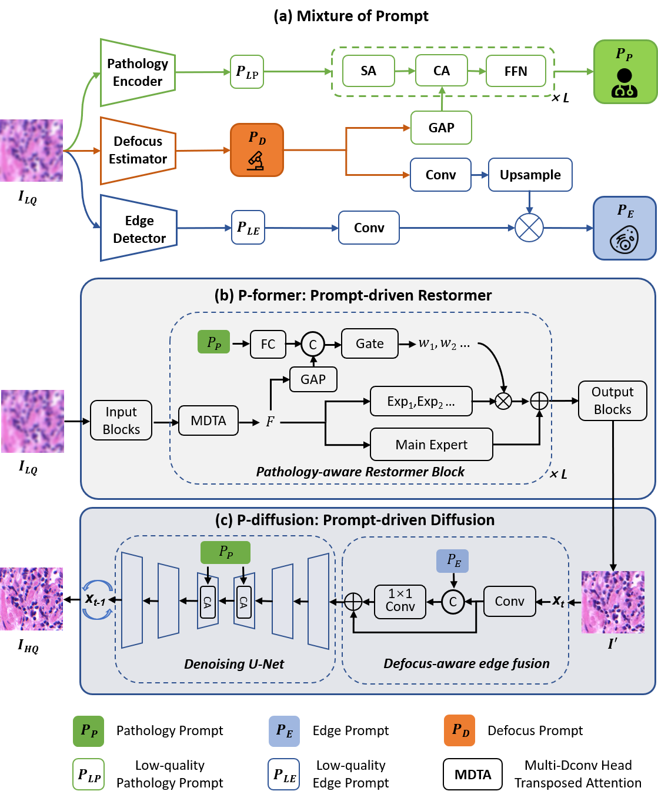

# MoP

## Overview

PyTorch implementation for Pathology Image Restoration via Mixture of Prompts [](https://arxiv.org/abs/2503.12399).




This repo contains:
- [MoP](#mop)
  - [Overview](#overview)
  - [Training of defocus encoder](#training-of-defocus-encoder)
    - [Dataset Format](#dataset-format)
    - [Usage](#usage)
  - [Trainnig of prompt restorer](#trainnig-of-prompt-restorer)
  - [Training of P-former](#training-of-p-former)
  - [Training of P-diffusion](#training-of-p-diffusion)
  - [Supplementary annotations and test code on 3DHistech](#supplementary-annotations-and-test-code-on-3dhistech)
  

## Training of defocus encoder

### Dataset Format
- Each folder contains the original and fused images from multiple fields of view for a single WSI.
  - xxx represents the id of the field.
  - `(xxx_01.jpg, xxx_02.jpg)`: Represents the low-quality images from different focal planes.
  - `(Z_xxx.jpg)`: Represents the corresponding fused image of a field.

- The training, validation, and test sets are recorded in separate `.txt` files.
- Each line in the `.txt` file contains information of a cropped image:
  - The image path
  - The CTF value
  - Distance from the optimal plane

### Usage

Download the weights of Resnet-18 before training.

Train the defocus encoder by:
```
cd defocus_encoder
python train.py
```

## Trainnig of prompt restorer

Download the weights of various pathology foundation models before training.

Train the prompt restorer by:
```
cd prompt_restorer
python train.py
```

Only for inference:
```
python infer.py
```


## Training of P-former

## Training of P-diffusion

## Supplementary annotations and test code on 3DHistech
